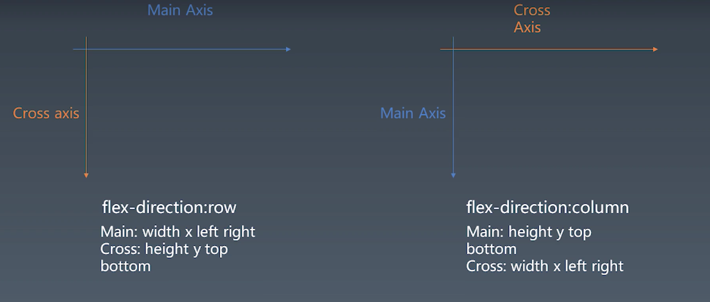

### 浏览器渲染过程
URL--HTTP-->HTML--parse-->DOM--css computing-->DOM with CSS --layout--> DOM with Position--render-->Bitmap

1. 访问url，通过发送http请求，并解析响应来获得HTML文本 （Request, Request Parser)
2. 解析HTML 文本，获得DOM 树 (parseHTML)
    1. 使用状态机解析文本，并收集对应的属性
    2. 在获得可以作为dom节点的内容时使用emit "发射" 元素
        1. 对于非文本节点和非自闭合节点，元素需要在匹配开始节点时入栈，遇到对应闭合节点时出栈
        2. 对于文本节点和自闭合节点，则无需入栈，但需要将其表明为当前栈顶元素的子元素。
        3. 对于所有节点，在emit时，都会根据当前token生成对应的Element
        4. 在emit中同时需要计算当前元素的css属性。
3. (其实这步和解析HTML文本应该同步进行) 解析 CSS 文本，和DOM节点结合(emit 时)，生成 带有CSS属性的DOM树
    1. 解析id， class， 复合选择器
    2. 解析优先级并得到最终的computedStyle
4. 

### 排版
#### 历史
1. 第一代：正常流， float， position， display
2. 第二代: flex布局
3. 第三代: grid布局
4. 第四代: Houndi

#### flex 排版

主轴 Main Axis：
排版时主要的延伸方向，由 flex-direction 决定 
交叉轴 Cross Axis：
和主轴相垂直的方向
- 如果主轴方向是 row.
    - 主轴方向 会有 width, x, left, right 属性
    - 交叉轴方向会有height, y, top, bottom 属性
- 如果主轴方向是column 则相反
